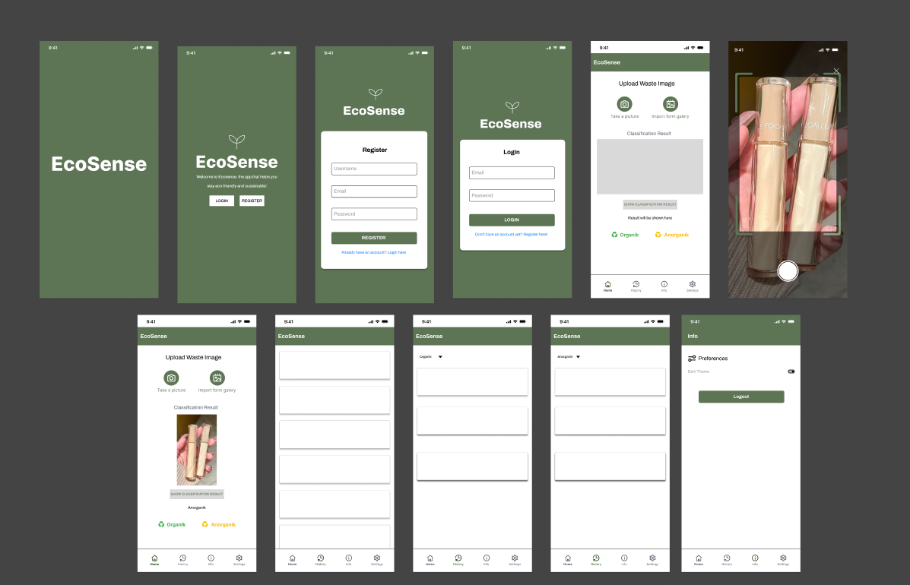

# EcoSense-C242-PS114: Front-End Services


## 💻 Built with

- Kotlin
- Android Studio

## 📌 Prerequisites

Before you get started, follow these requirements
- Kotlin SDK >=1.9.0
- Gradle Version 8.5
- Konfigure JAVA_HOME

## 🍃 How to Setup

1. Download or Clone the repository by running the following command in your terminal or Git Bash:
  ```bash
  git clone -b MD https://github.com/yudhistirank/EcoSense-C242-PS114.git
  ```
2. Move the project to the selected directory
3. Open the project with a code editor
   - Recommended editors: Android Studio
6. Sync the Project to Automation download the configuration
7. Run the Project
   - 
8. **Important**: Do not update or upgrade Gradle or any other versions until the app is up and running with built versions.


## 🚀 How to Run

- Run Main
- Launch Device
- Run on the device

## 📸  Images


## 💎 Dependencies

- Retrofit - https://square.github.io/retrofit/
- Glide - https://github.com/bumptech/glide
- CameraX - https://developer.android.com/media/camera/camerax
- Room Database- https://developer.android.com/training/data-storage/room
- CardView - https://developer.android.com/reference/kotlin/androidx/cardview/widget/CardView

## 🖼️ Project Gallery

Project app design - [Click here to view](https://www.figma.com/design/zVTyNA6b7iFHF1EloVYK2w/Capstone?node-id=0-1&t=hFmJ0t5MI6d3NFZY-1)

## 👨‍💻 Developed By

EcoSense Capstone Team <br>
C242-PS114 <br>
Bangkit Academy

## 💬 Contact

If you want to contact us, leave a message via email

Email - [EcoSense Team](mailto:C242-PS114@bangkit.academy)

## ❤️ Thanks

Thank you to all parties who have contributed to the development of this project

